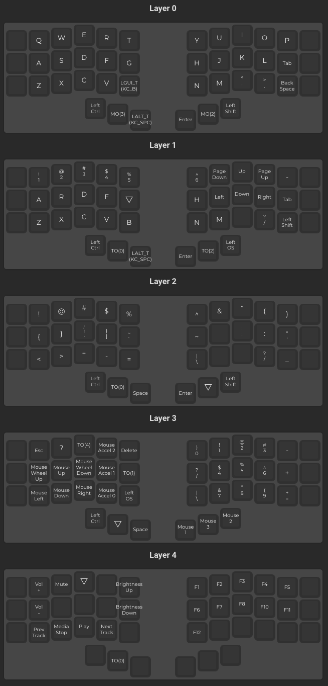
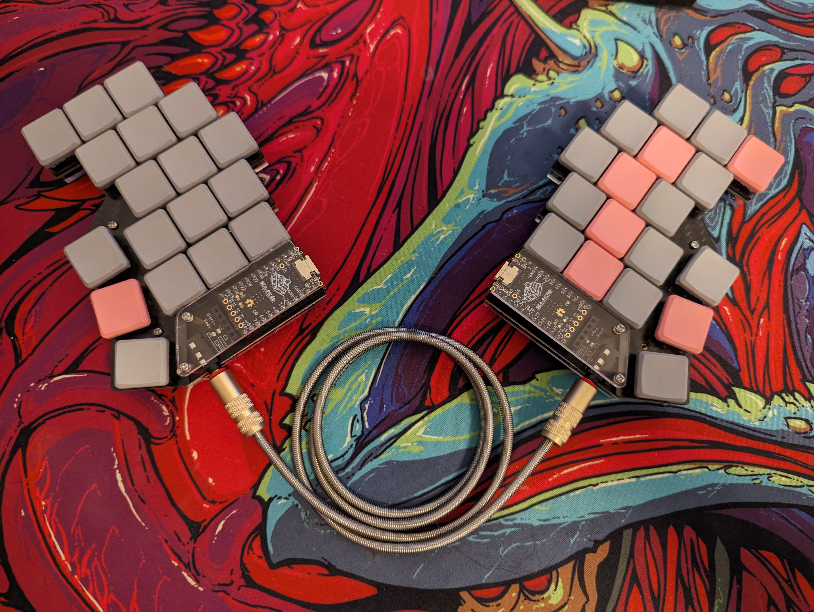

# qmk
My cantor layout

---
My [Moonlander](https://configure.zsa.io/moonlander/layouts/NZX5X/latest/3) setup

qmk cantor [link](https://github.com/qmk/qmk_firmware/tree/master/keyboards/cantor)

Build tool: https://config.qmk.fm

## Layout


## New Chocofi build/layout

For this build I take the JSON file in this repo to then convert it to C using json2c, like:
```bash
qmk json2c theJsonFileInThisRepo.json > output.c
```

Note that I needed to change the top of the json, like this:

```json
  "keyboard": "crkbd/rev1",
  "keymap": "cantor_fh-chocofi",
  "layout": "LAYOUT_split_3x6_3",
```

This to make it for the new keyboard.

I then moved this newly created file to the qmk folder(repo) in the correct location
> ../qmk_firmware/keyboards/crkbd/keymaps/neverw8/keymap.c

This will allow me to to convert it to the rp2040 (a uf8 file)

```bash
 qmk compile -kb crkbd/rev1 -km neverw8 -e CONVERT_TO=promicro_rp2040
```

Then hit reset on my controller and drop the file in the explorer/mount window.


